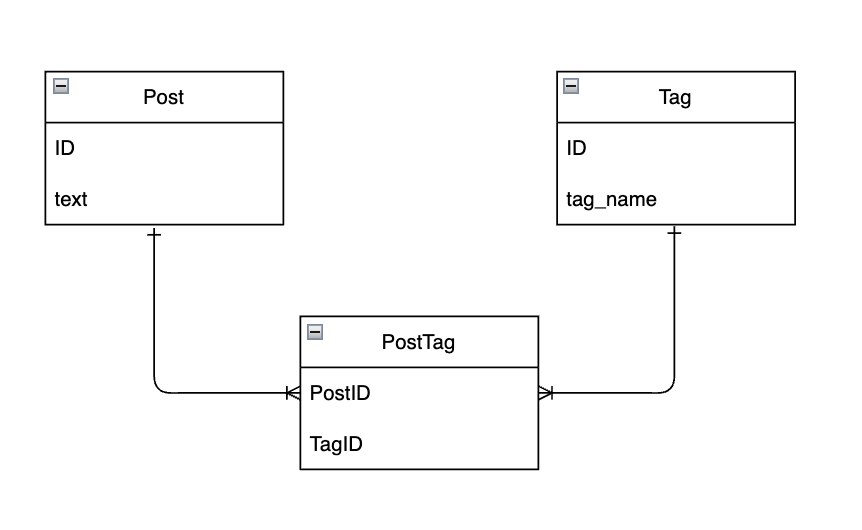

## 課題1-1

以下のPostのように、tagsカラムの中にカンマ区切りで複数の値を入れている設計を稀に見かけます。



上記の例では、「投稿(Post)」に紐づけられた「タグ」を表現するために、投稿テーブルに「タグ」というカラムを持ち、その中に `tagA, tagB, tagC`といった形でカンマ区切りで格納しています。

この設計だとどのような問題が生じるか、説明してみてください。

<aside>
💡 「もし将来こんな仕様変更があったら、どれだけ大きなスキーマ変更になるだろうか？」「今の作りだと表現できないユースケースがあるのでは？」など、具体的なケースを沢山仮定して考えてみると良いかもしれません！

</aside>

カラムの型（varchar）は今の段階では特に気にしないで結構です。

データベース設計の課題領域では「どのようにテーブルを分けるか」「どのカラムにどの情報を格納するか」の2点のみ考えていただくのが目的なので、データ型は今回の考慮対象ではありません。

<br>
<br>

## 回答
### 問題点として
#### SQLが複雑になる
- 特定のタグを持つPostを検索して取得する例:
カンマ区切りの「タグ」カラムから、特定のタグ（例: tagA）を持つ投稿を検索する場合、LIKE 演算子を使った文字列検索が必要になる。
```SQL
SELECT *
FROM Post
WHERE tags LIKE 'tagA,%'
   OR tags LIKE '%,tagA'
   OR tags LIKE '%,tagA,%'
   OR tags = 'tagA';
```
タグがカンマ区切りで入っているため、タグが先頭、中間、末尾、あるいは唯一のタグかどうかをそれぞれ条件に入れなければならない。
データ量が増えるとパフォーマンスが悪化する。


- タグを削除する場合のクエリ例：
id = 1 の投稿から tagB を削除する場合は、文字列を部分的に置換しなければなりません。
```sql
UPDATE Post
SET tags = TRIM(BOTH ',' FROM REPLACE(CONCAT(',', tags, ','), ',tagB,', ','))
WHERE id = 1;
```
このクエリでは、カンマで囲まれたタグのリストから tagB を削除するために、REPLACE 関数と CONCAT を使ってタグリストを加工している。
タグが先頭や末尾にある場合の考慮も必要なので、かなり複雑。