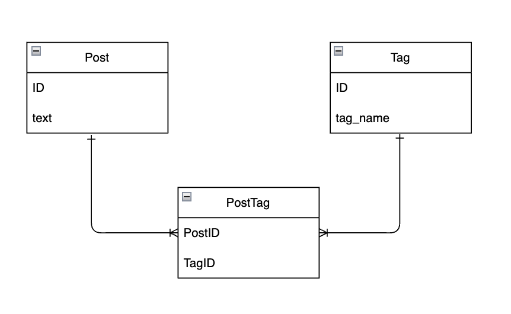

## 課題2-1

[課題1](https://www.notion.so/ea2c02fef55244f5ab759445669fc163?pvs=21)の問題点を解決するよう、スキーマ設計を変更してみてください。

投稿に対するタグの情報をどのように保持するのが適切でしょうか？
新しいスキーマを考えて、DB設計のスケッチを描いてみてください。

## 回答
- タグの管理は、Tagテーブルに切り分けて行う。
- 投稿とタグの管理は「PostTag」テーブルで管理を行う。

### 懸念点として
- 「タグ名」が被らないように、ユニーク制約を設ける
- 「投稿とタグの組み合わせ」が被らないように、ユニーク制約を設ける