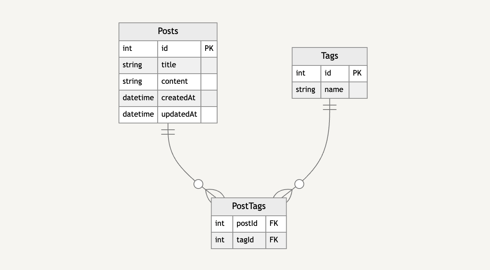

## 課題1

先程のPostの設計で生じた問題を解決するため、以下のようにテーブル設計を見直したとします。

Postに紐づくTagのidを複数のカラムで管理しています。

例えばタグAを一つ追加したら`tag1Id`のカラムにタグAのidが入るようなイメージです。
1つしかタグが紐づいていない場合、`tag2Id`と`tag3Id`はNULLとなるイメージです。

上記の設計だと、どのような問題が生じるか説明してください。

### 回答
- クエリの複雑化： 
特定のタグを持つ投稿を検索する際、全てのタグカラムを確認する必要があり、SQLクエリが複雑になります。これはパフォーマンスの低下につながる可能性がある。

 
 

## 課題2
どのようにテーブル設計を見直せば[課題1](https://www.notion.so/1-552a76de0fa3467ca05e5c9e2f28658b?pvs=21)の問題は解決できるでしょうか？
新しいスキーマを描いてみてください。

### 回答

 
 

## 課題3
どんなサービスを開発している時に[課題1](https://www.notion.so/1-552a76de0fa3467ca05e5c9e2f28658b?pvs=21)のようなアンチパターンに陥りそうでしょうか？
最低でも1つは例を考えてみてください。

例：商談管理サービスを開発していると仮定する

- 「Meeting」テーブルを作成して「参加者id」をカラムとして保持している
    - 当初は自社の社員が1名しかMeetingに参加しない予定だったが、仕様変更により何人でも参加できるようになったため、とりあえず参加者idカラムを10個に増やした時にアンチパターンに陥る、など

### 回答
- **シナリオ：** ユーザーが記事を投稿し、カテゴリーを付けられるブログプラットフォームを開発しています。
- **アンチパターンの発生：** 当初、各記事に1つのカテゴリーしか付けられないと想定していました。そのため、「Posts」テーブルに「categoryId」というカラムを作成しました。しかし、ユーザーからの要望で複数のカテゴリーを付けられるようにする必要が出てきました