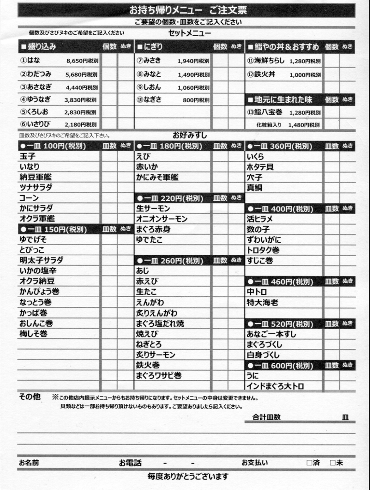
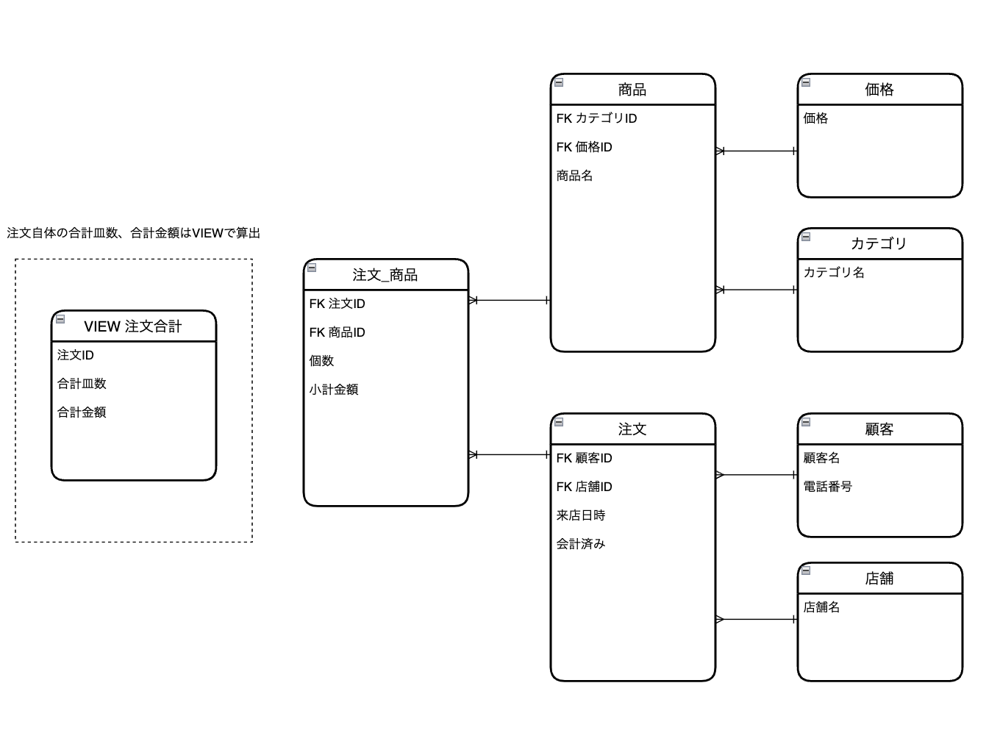

# データベースモデリング課題1

## 課題1-1


<br>

### 必要であろうエンティティ（テーブル）、属性（カラム）
| エンティティ   | 属性         | 値の例　|
|-------------|------------|------------|
| 価格        | 価格値(円)   | 100<br>150<br>180 |
| カテゴリ      | カテゴリ名  | 盛り込み<br>地元に生まれた味<br> 好みすし |
| 顧客        | 顧客名       | 山田 太郎<br>山田 花子 |
|             | 電話番号      | 090xxxxxxxx |
| 店舗        | 店舗名       | xxx店 |
| 商品        |  FK 価格ID     | |
|             | FK カテゴリーID  |　 |
|             | 商品名      | はな<br>鮨八方巻<br>えび<br>いくら |
| 注文        | FK 顧客ID      |  |
|             | FK 店舗ID      |  |
|             | 来店日時     | 2023-12-30 |
|             | 会計済み     | true<br>false<br> |
| 注文_商品    | FK 注文ID      | |
|             | FK 商品ID      ||
|             | 個数        | 2<br>4<br> |
|             | 小計金額(円)     | 1000<br>2500<br> |
| 注文合計（VIEW） | 注文ID      | |
|             | 合計皿数     | 10<br>20<br> |
|             | 合計金額(円)     | 5000<br>7000<br> |

※ 「注文_商品」テーブルにおいて各オーダーに紐付く各商品ごとの小計を管理しています。
注文自体の合計を管理についてはテーブルを作るVIEWのクエリ文は以下を想定

```
SELECT
    注文ID,
    SUM(個数) as 合計皿数,
    SUM(小計金額) as 合計金額
FROM
    注文_商品
GROUP BY
    注文ID;
```  

<br>

### 概念モデルのスケッチ


<br>
<br>

## 課題1-2（任意）
### 物理モデルと論理モデルって何が違うのでしょう？
- 論理モデル
  - 目的: データの概念的な構造を表現。
  - 内容: システムで扱うエンティティ、属性、関係性をビジネスルールに基づいて記述。
  - 使用者: ビジネスアナリストやエンドユーザーなど、技術的な詳細を抜きにした理解が可能。
- 物理モデル
  - 目的: 実際のデータベースの実装設計を提供。
  - 内容: テーブル名、カラム名、データタイプ、インデックス、制約など、具体的なデータベースシステムの構造を記述。
  - 使用者: データベース管理者やシステム開発者など、技術的な背景を持つ専門家。

  要するに、論理モデルはデータの「概念的なビュー」を提供し、物理モデルはそのデータを「実際にどのように格納するか」に焦点を当てたモデルです。