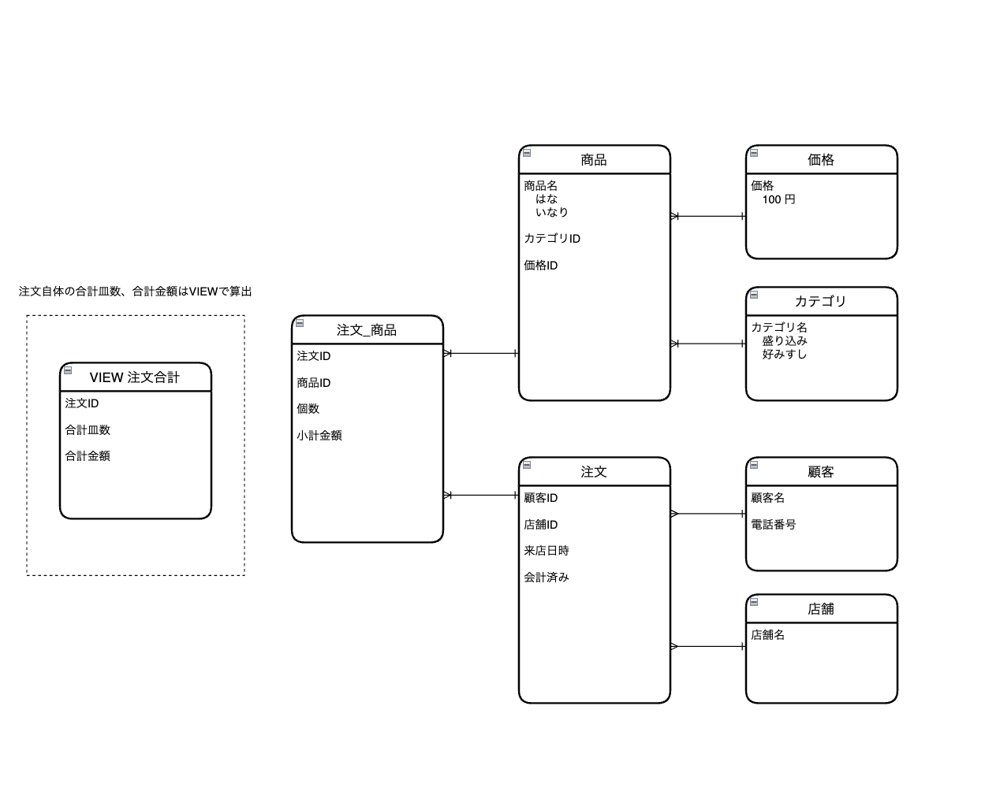

# データベースモデリング課題1

## 課題1-1

### 必要であろうエンティティ（テーブル）、属性（カラム）

| エンティティ   | 属性         |
|-------------|------------|
| 価格        | 価格値       |
| カテゴリ      | カテゴリ名     |
| 顧客        | 顧客名       |
|             | 電話番号      |
| 店舗        | 店舗名       |
| 商品        | 商品名       |
|             | カテゴリーID  |
|             | 価格ID      |
| 注文        | 顧客ID      |
|             | 店舗ID      |
|             | 来店日時     |
|             | 会計済み     |
| 注文_商品    | 注文ID      |
|             | 商品ID      |
|             | 個数        |
|             | 小計金額     |
| 注文合計（VIEW） | 注文ID      |
|             | 合計皿数     |
|             | 合計金額     |

<br>
※ VIEWのクエリ文は以下を想定

```
SELECT order_id, Sum(amount), Sum(price)
FROM "order_product"
GROUP BY order_id
```  
<br>
<br>

## 課題1-2
### 物理モデルと論理モデルって何が違うのでしょう？
- 論理モデル
  - 目的: データの概念的な構造を表現。
  - 内容: システムで扱うエンティティ、属性、関係性をビジネスルールに基づいて記述。
  - 使用者: ビジネスアナリストやエンドユーザーなど、技術的な詳細を抜きにした理解が可能。
- 物理モデル
  - 目的: 実際のデータベースの実装設計を提供。
  - 内容: テーブル名、カラム名、データタイプ、インデックス、制約など、具体的なデータベースシステムの構造を記述。
  - 使用者: データベース管理者やシステム開発者など、技術的な背景を持つ専門家。

  要するに、論理モデルはデータの「概念的なビュー」を提供し、物理モデルはそのデータを「実際にどのように格納するか」に焦点を当てたモデルです。