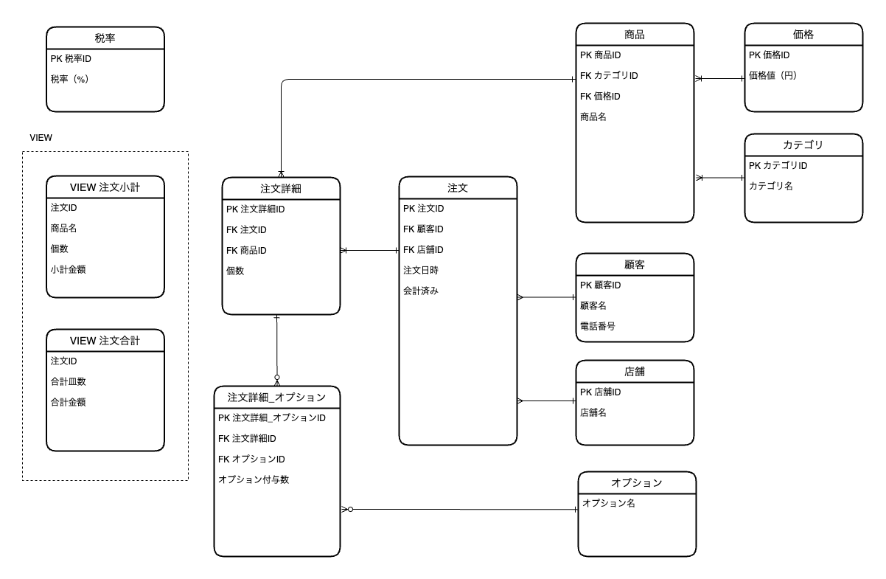

## 2024/01/04のMTGにて
### レビュー内容


前回のMTGにて上記のテーブル構成について、トリオのメンバーから以下レビューを受けました
  - 「注文詳細」テーブルについて
      - 「小計金額」はテーブルではなくviewの方で計算できるのでは？
      - 「個数」などの値は直接入れれるが、小計金額となるとバックエンド側で計算しなければならないので複雑になりそう
  - 中心となるテーブル、今回だと「注文」テーブルが上に来た方が見やすいかも
  - 「税率」テーブルも必要かも

### 対策
レビューを踏まえて、以下の対応をしました。
- 「注文小計」をVIEWに切り分け
- 「注文」テーブルが中心となる様な図に変更
- 「税率」テーブルの作成



  ※ 注文小計VIEWの構造は以下のイメージ
  ```SQL
    CREATE VIEW 注文小計 AS
    SELECT 
      注文ID,
      商品.商品名,
      注文詳細.個数,
      SUM(価格.価格) as 小計金額
    FROM 
      注文詳細
    JOIN 
      商品 ON 注文詳細.商品ID = 商品.ID
    JOIN 
      注文 ON 注文詳細.注文ID = 注文.ID
    JOIN
      価格 ON 商品.価格ID = 価格.ID
    GROUP BY 
      注文ID;
  ```


<br>
<br>

### テーブル、カラムの内容
各テーブルとカラムに解説を加えた場合の表は、以下のようになります。これらの表では、各テーブルの用途と各カラムの意味を簡潔に説明しています。

#### 価格テーブル
各商品の価格を保持します。

| カラム   | 解説         | 値の例         |
|----------|-------------|---------------|
| 価格(円) | 商品の価格   | 100, 150, 180 |


---

#### カテゴリテーブル
商品を分類するためのカテゴリ情報を格納します。

| カラム     | 解説           | 値の例                       |
|------------|---------------|-----------------------------|
| カテゴリ名 | 商品が属するカテゴリ名 | 盛り込み, 地元に生まれた味, 好みすし |


---

#### 顧客テーブル
店舗の顧客情報を保持しています。

| カラム   | 解説             | 値の例           |
|----------|-----------------|-----------------|
| 顧客名   | 顧客の氏名       | 山田 太郎, 山田 花子 |
| 電話番号 | 顧客の電話番号   | 090xxxxxxxx     |


---

#### 店舗テーブル
各店舗の情報を保持します。

| カラム | 解説     | 値の例 |
|--------|---------|--------|
| 店舗名 | 店舗の名前 | xxx店  |

---

#### 商品テーブル
商品の詳細情報を保持し、価格とカテゴリにリンクします。

| カラム           | 解説                 | 値の例                       |
|------------------|---------------------|-----------------------------|
| FK 価格ID       | 価格テーブルの外部キー |                             |
| FK カテゴリーID | カテゴリテーブルの外部キー |                             |
| 商品名           | 商品の名前           | はな, 鮨八方巻, えび, いくら |

---

### 注文テーブル
顧客による注文の記録を保持します。

| カラム     | 解説                   | 値の例        |
|------------|-----------------------|--------------|
| FK 顧客ID  | 顧客テーブルの外部キー |              |
| FK 店舗ID  | 店舗テーブルの外部キー |              |
| 注文日時   | 注文が行われた日時     | 2023-12-30   |
| 会計済み   | 注文が支払い済みかどうか | true, false  |

---

#### 注文詳細テーブル
各注文における商品ごとの詳細情報を保持します。（注文された商品がどの注文IDに属しているかを表していて、注文の小計,合計金額はVIEWで計算している）

| カラム       | 解説                     | 値の例          |
|--------------|-------------------------|----------------|
| FK 注文ID    | 注文テーブルの外部キー   |                |
| FK 商品ID    | 商品テーブルの外部キー   |                |
| 個数         | 注文された商品の数量     | 2, 4           |

---

#### オプションテーブル
商品に適用可能な追加オプション情報を格納。（ワサビ抜き等はこちらのオプションテーブルで管理）

| カラム     | 解説         | 値の例    |
|------------|-------------|----------|
| オプション名 | 商品のオプション名 | ワサビぬき |

---

### 注文詳細_オプションテーブル
各注文詳細に適用されるオプションとその数量を記録します。

| カラム                   | 解説                         | 値の例 |
|--------------------------|-----------------------------|-------|
| FK 注文詳細ID            | 注文詳細テーブルの外部キー   |       |
| FK オプションID          | オプションテーブルの外部キー |       |
| オプション付与数         | 適用されるオプションの数     | 5, 8  |

---

### 税率テーブル
税率に関する情報を記録します。

| カラム                   | 解説                         | 値の例 |
|--------------------------|-----------------------------|-------|
| 税率（%）          | 税率のパーセンテージを示す |  8(%), 10(%)     |

---

### 注文小計（VIEW）
各注文の総皿数と合計金額を集計するビューです。

| カラム     | 解説                 | 値の例        |
|------------|---------------------|--------------|
| 注文ID     | 各注文のID           |              |
| 商品名   | 各注文に含まれる商品名  | 10, 20       |
| 個数 | 各注文の商品ごとの注文個数     | 5000, 7000   |
| 小計金額(円) | 各注文の商品ごとの小計金額     | 5000, 7000   |

---

### 注文合計（VIEW）
各注文の総皿数と合計金額を集計するビューです。

| カラム     | 解説                 | 値の例        |
|------------|---------------------|--------------|
| 注文ID     | 各注文のID           |              |
| 合計皿数   | 注文された総皿数     | 10, 20       |
| 合計金額(円) | 各注文の合計金額     | 5000, 7000   |
