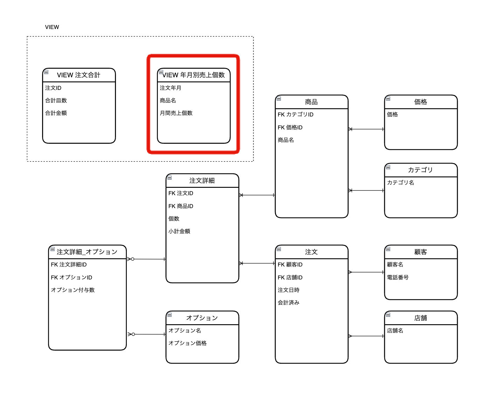

# データベースモデリング課題2　
## 課題2-1

今後はわさびの有無のみならずシャリの大小も選べるようになりました。
どのようにテーブル設計をするべきでしょうか？

- オプションテーブルにて、オプション名「シャリ大」と言うレコードを新た追加
- 「オプション価格」カラムを新たに追加（無料オプションある事を想定してNULL許容を設定する）

| エンティティ   | 属性         | 値の例　|
|-------------|------------|------------|
| オプション    | オプション名 |　シャリ大 　 |
| 　　　　　    | オプション価格（円）| 10   |


<br>
<br>

## 課題2-2

人気の寿司ネタを特定したいので、「はな」「わだつみ」などのセット商品の売り上げとは別に、寿司ネタが毎月何個売れているのか知る必要が生じました。
どのようにテーブル設計をするべきでしょうか？

- 「年月別売上個数」の様な年月毎に寿司ネタの売数を計算するVIEWを作成する

  

  ```SQL
  CREATE VIEW 年月別売上個数 AS
  SELECT 
    DATE_FORMAT(注文.注文日時, '%Y-%m') as 注文年月,
    商品.商品名,
    SUM(注文詳細.個数) as 月間売上個数
  FROM 
    注文詳細
  JOIN 
    商品 ON 注文詳細.商品ID = 商品.ID
  JOIN 
    注文 ON 注文詳細.注文ID = 注文.ID
  JOIN
    カテゴリ ON 商品.カテゴリID = カテゴリ.ID
  WHERE
    カテゴリ.カテゴリ名 = '好みすし'
  GROUP BY 
    注文年月, 商品.ID;
  ```

- 上記クエリの概要として
  - ビューの作成: CREATE VIEW で「年月別売上個数」VIEWを作成。
  - 日付のフォーマット: DATE_FORMAT(注文.注文日時, '%Y-%m') as 注文年月 で注文日時を年月形式（例：2023-03）にフォーマットし、それを「注文年月」と定義（のちのGROUP BYの対象とするため）。
  - JOIN操作: 「注文詳細」テーブルと「商品」「注文」「カテゴリ」テーブルを結合。
  - 集計対象を「寿司ネタ」にフィルタリング: WHERE 商品.カテゴリ名 = '好みすし'（好みすし=寿司ネタ）で特定のカテゴリに属する商品のみをフィルタリング。
  - 集計: SUM(注文詳細.個数) as 月間売上個数 で各商品の注文個数の合計を計算。
  - グループ化: GROUP BY 注文年月, 商品.商品名 で結果セットを注文年月と商品名でグループ化して、年月毎に特定の商品がいくつ売れたかを集計。

<br>
<br>

## 課題2-3

上記の他にも今後発生しそうな追加仕様を1つ挙げてみてください。
自分が考えた追加仕様をトリオと交換して、お互いの仕様を満たすようにテーブルを設計し直してください。

- クーポン利用
  - クーポンには何種類かあり対象商品によって値引き内容が変わる
    - 会計全体から⚪︎円値引き
    - セットメニュ-のみ対象、⚪︎%値引き
  - クーボンには有効期限がある