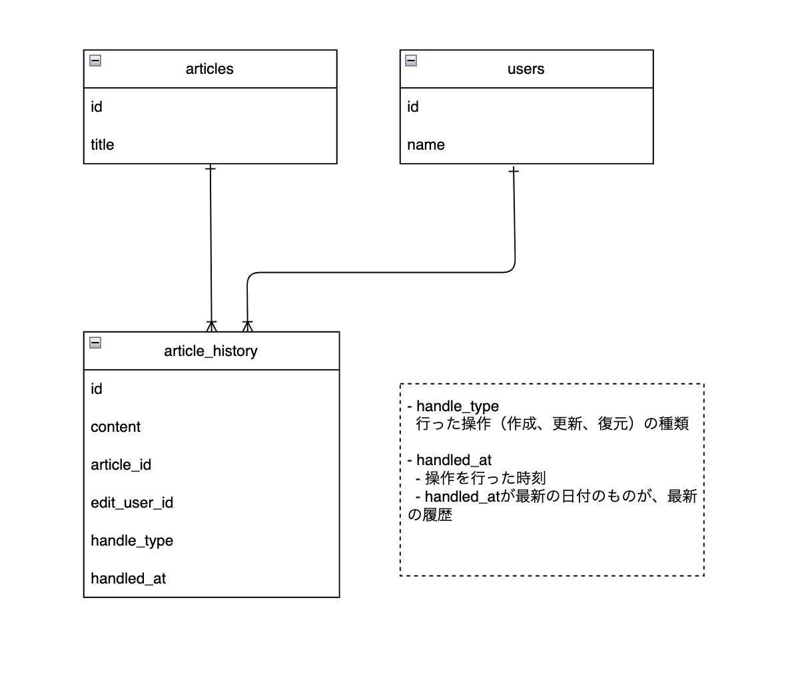

# 課題5-1

## 概要
記事と、その編集履歴を保存できるサービス（ブログサービスのようなもの）のデータベースを設計して、UML図を作成してください。
以下の機能を備えているものとします。
- 記事
    - 1000文字程度の本文を記入して保存できる
- 記事の履歴
    - 記事を更新すると履歴が保存される
    - 特定の記事の履歴を一覧表示できる
    - 履歴を選択して過去の記事状態に戻す事が可能
- 記事の閲覧
    - 最新状態の記事を一覧表示できる

## 考察


- 1000文字程度の本文を記入して保存できる
  - articles.contentに文字数制限
- 記事を更新すると履歴が保存される
  - article_historyで履歴管理
  - 最新の履歴はrecent_historyで管理
- 特定の記事の履歴を一覧表示できる
  - handle_typeが「更新」のレコードを条件にフィルタリングすれば一覧が取得できる？
- 履歴を選択して過去の記事状態に戻す事が可能
  - recent_history_id を持たせる
- 最新状態の記事を一覧表示できる

## DDL
```sql
CREATE TABLE users (
    id INT AUTO_INCREMENT PRIMARY KEY,
    name VARCHAR(255) NOT NULL
);

CREATE TABLE articles (
    id INT AUTO_INCREMENT PRIMARY KEY,
    title VARCHAR(255) NOT NULL,
);

CREATE TABLE article_history (
    id INT AUTO_INCREMENT PRIMARY KEY,
    content TEXT NOT NULL,
    article_id INT NOT NULL,
    edit_user_id INT NOT NULL,
    handle_type ENUM('create', 'update', 'restore') NOT NULL,
    handled_at DATETIME NOT NULL,
    -- recent_history_id INT,
    FOREIGN KEY (article_id) REFERENCES articles(id),
    FOREIGN KEY (edit_user_id) REFERENCES users(id)
);
```

## DML
```sql
-- usersテーブルへのデータ挿入
INSERT INTO users (name) VALUES ('User A'), ('User B');

-- articlesテーブルへのデータ挿入
INSERT INTO articles (title) VALUES ('Article 1');

-- article_historyテーブルへのデータ挿入
INSERT INTO article_history (id, content, article_id, edit_user_id, handle_type, handled_at) 
VALUES (1, 'This is the content of Article 1.', 1, 1, 'create', NOW());

-- 記事の更新した際のクエリ
-- UPDATEではなく新しいレコードを作成するのでINSERT
INSERT INTO article_history (id, content, article_id, edit_user_id, handle_type, handled_at) 
VALUES (2, 'Updated content of Article 1.', 1, 2, 'update', NOW());

-- 記事の復元のクエリ
-- 記事の内容を article_history id:1 の状態に戻したい
INSERT INTO article_history (id, content, article_id, edit_user_id, handle_type, handled_at) 
VALUES (3, SELECT content FROM article_history WHERE id = 1, 1, 2, 'restore', NOW());


```


## ユースケースを想定したクエリ
```sql
-- 「ユーザー1」が新規で「記事1」の作成をする
INSERT INTO articles (id, title)
VALUES (1, 'Title1');
-- 「articles」のレコード生成と同時に「article_history」のレコードも生成される
INSERT INTO article_history (id, content, article_id, edit_user_id, handle_type, handled_at) 
VALUES (1, 'This is the content of Article 1.', 1, 1, 'create', NOW());

-- 「ユーザー1」が「記事1」の更新
INSERT INTO article_history (id, content, article_id, edit_user_id, handle_type, handled_at) 
VALUES (2, 'Updated content of Article 1.', 1, 1, 'update', NOW());

-- 「ユーザー1」が記事を「 article_history id : 1 」の状態に復元
INSERT INTO article_history (id, content, article_id, edit_user_id, handle_type, handled_at)
SELECT 3, content, 1, 2, 'restore', NOW()
FROM article_history
WHERE id = 1;

-------------

-- 「ユーザー1」が新規で「記事2」の作成をする
INSERT INTO articles (id, title)
VALUES (2, 'Title2');
-- 「articles」のレコード生成と同時に「article_history」のレコードも生成される
INSERT INTO article_history (id, content, article_id, edit_user_id, handle_type, handled_at) 
VALUES (4, 'This is the content of Article 1.', 2, 1, 'create', NOW());

-- 「ユーザー1」が「記事2」の更新
INSERT INTO article_history (id, content, article_id, edit_user_id, handle_type, handled_at) 
VALUES (5, 'Updated content of Article 1.', 2, 1, 'update', NOW());

-- 「ユーザー1」が 「 article_history id : 2 」 の状態に復元
INSERT INTO article_history (id, content, article_id, edit_user_id, handle_type, handled_at)
SELECT 6, content, 2, 1, 'restore', NOW()
FROM article_history
WHERE id = 4;


-- 記事の履歴一覧を取得する
-- SELECT * FROM article AS a
-- JOIN article_history AS ah
-- ON a.id = ah.article_id
-- WHERE handled_at = (SELECT MAX(handled_at) FROM article_history);

SELECT a.*, ah.*
FROM articles AS a
JOIN article_history AS ah
ON a.id = ah.article_id
WHERE ah.handled_at = (
    SELECT MAX(ah2.handled_at)
    FROM article_history AS ah2
    WHERE ah2.article_id = ah.article_id
);


```
