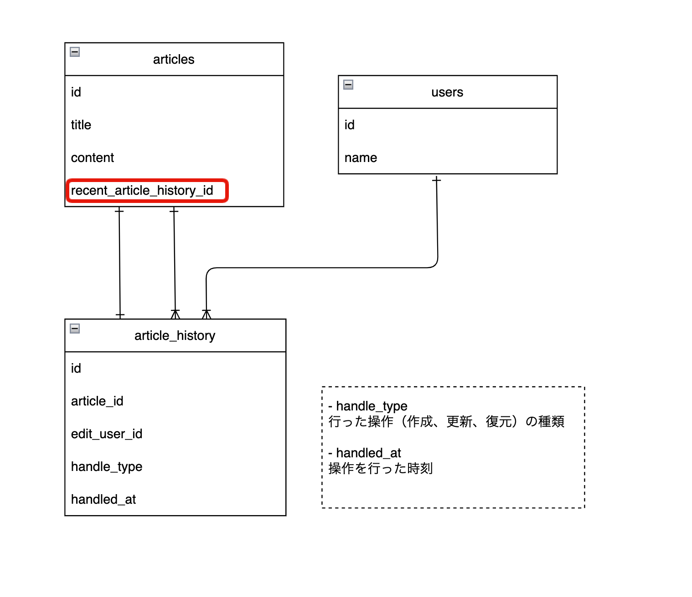
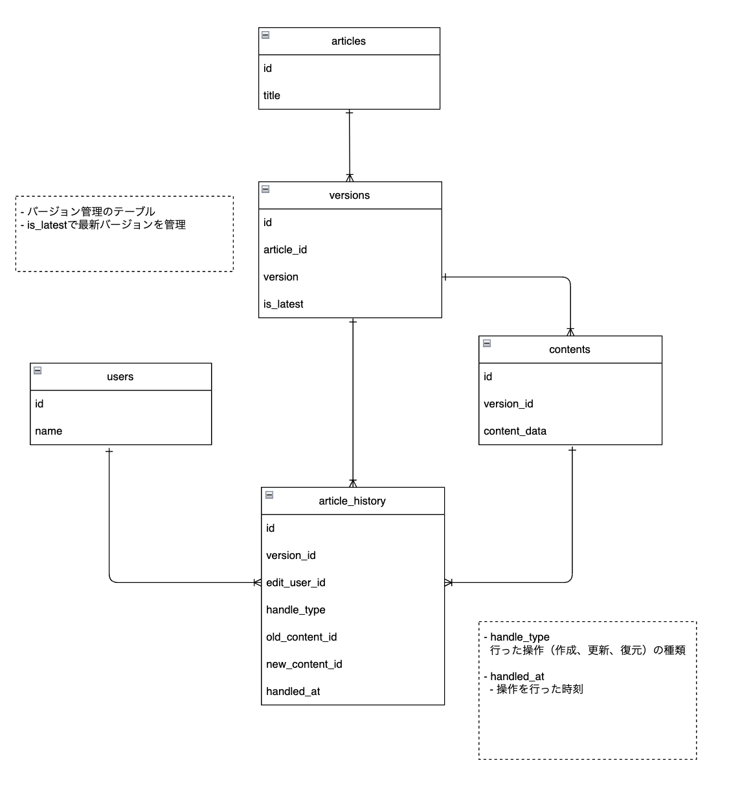

# 課題5-2

## 概要
### 課題5-2-1
今回のようにアプリケーションに利用（履歴を一覧表示したり、履歴を復元）されるような履歴データはデータベースとして保存する必要がありますが、例えば「後から分析したいから履歴を残しておいて」など、分析のみの用途でも履歴データをデータベースに保存しておく必要はあるのでしょうか？ペアと話し合ってみてください。

### 課題5-2-2
履歴データの表現には様々な方法があります。
ご自身が課題1の回答で採用した設計とは異なるアプローチでもUML図を作成してみましょう。
どのようなメリット/デメリットがあるでしょうか？

## 考察
### 課題5-2-1について

履歴など「ビッグデータ」の管理は「Google BigQuery」などのクラウドサービスを利用すれば良いとの話をしたが、それ以外の似たようなサービスを調べてみたら以下のようなクラウドサービスが出てきた。
どれを使うかは、会社の方針などユースケースに応じて使い分けたい

| 特徴/サービス       | **Google BigQuery**                             | **Amazon Redshift**                             | **Amazon Athena**                             | **AWS Glue**                                   | **Azure Synapse Analytics**                        | **Azure Data Lake Analytics**                   | **Azure Data Factory**                           |
|---------------------|-------------------------------------------------|-------------------------------------------------|------------------------------------------------|------------------------------------------------|----------------------------------------------------|--------------------------------------------------|---------------------------------------------------|
| **サービスの種類**  | サーバーレスなデータウェアハウス               | クラウドデータウェアハウス                     | サーバーレスなクエリエンジン                 | サーバーレスETLサービス                         | 統合された分析サービス（データウェアハウス+データレイク） | サーバーレス分析サービス                        | データ統合とETLサービス                           |
| **クエリ言語**      | 標準SQL                                          | 標準SQL                                          | 標準SQL                                          | Python/ScalaでのETLスクリプト                    | T-SQL, Spark SQL, SQL Pool                       | U-SQL                                           | Python, SQL, その他複数の形式                   |
| **ストレージの場所**| BigQuery 内部ストレージ、または Google Cloud Storage | Redshift クラスター内部、または S3 (Redshift Spectrum) | S3 に保存されたデータ                          | S3、RDS、Redshift などの複数のデータソース      | Azure Data Lake Storage, Azure Blob Storage      | Azure Data Lake Storage                         | Azure Blob Storage, Azure SQL Database, その他 |
| **スケーリング**    | 自動でスケール                                   | 手動でクラスターノードを追加                     | 自動でスケール                                   | 自動でスケール                                   | 自動スケール                                    | 自動スケール                                    | 自動スケール                                     |
| **サーバーレス**    | サーバーレス                                     | クラスター管理が必要                             | サーバーレス                                     | サーバーレス                                     | SQL On-Demand クエリや Spark Pool クエリはサーバーレス | サーバーレス                                     | サーバーレス                                     |
| **主なユースケース**| データウェアハウス、リアルタイム分析、BI         | 大規模なデータウェアハウス、BI、データマート     | データレイク分析、ログ分析、インタラクティブクエリ | ETLパイプライン、データクレンジング、データカタログ | データウェアハウス、BI、リアルタイム分析          | 大規模データ処理と分析                          | ETL パイプライン、データ変換、データ移行          |
| **料金モデル**      | ストレージとクエリ実行に基づく従量課金制         | クラスターのサイズに基づいたインスタンス料金     | クエリの実行したデータスキャン量に基づく従量課金 | ジョブの実行時間に基づいた従量課金               | ストレージとコンピューティングの従量課金制        | 実行時間に基づく従量課金制                     | ジョブの実行時間に基づいた従量課金               |
| **データサイズ**    | ペタバイト級のデータを扱える                     | ペタバイト級のデータを扱える                     | ストレージに依存（通常、S3 のデータを対象）       | データの大規模な処理が可能                       | ペタバイト級のデータを扱える                     | 大規模データを扱える                             | 大規模データ統合と変換に対応                     |
| **データフォーマット**| ネイティブフォーマット、JSON、CSV、Parquet など  | 列指向データ、S3 上のデータ（Parquet、ORC など） | CSV、JSON、Parquet、ORC など                     | 様々な形式 (CSV、JSON、Parquet など) をサポート  | CSV、Parquet、JSON、ORC など                      | U-SQL, CSV, JSON, Parquet, ORC など               | CSV、JSON、Parquet、ORC など                     |
| **リアルタイム分析**| ストリーミングデータをサポート                   | Redshift Spectrum でリアルタイムに近いクエリが可能 | 可能（遅延が発生することもある）                 | リアルタイム分析には特化していない               | Azure Stream Analytics と統合することで可能       | 特定のリアルタイム処理には非対応                 | 可能                                             |
| **データの取り込み**| BigQuery Data Transfer Service での定期的なデータインジェスト | S3 やデータベースからのデータ取り込み           | S3 にアップロードされたデータに直接クエリ       | AWS データソースからの ETL をサポート            | Azure Data Factory, Synapse Pipeline で対応      | Azure Blob Storage, Azure Data Lake からの取り込み | Azure Data Factory でデータ取り込み               |
| **機械学習との統合**| BigQuery ML で機械学習モデルを直接クエリ         | SageMaker やその他ツールと統合可能               | SageMaker やその他ツールと統合可能               | 機械学習の準備としてデータをクレンジング可能     | Azure Machine Learning と統合可能               | Azure Machine Learning と統合可能                | Azure Machine Learning と統合可能                |
| **可用性と耐障害性**| 高い可用性と冗長性                               | マルチAZ デプロイが可能                           | 高い可用性と冗長性                               | 高い可用性と冗長性                               | 高い可用性と冗長性                                 | 高い可用性                                       | 高い可用性                                       |
| **データ統合**      | GCS や Bigtable などの Google Cloud サービスと統合 | S3 や RDS、DynamoDB などの AWS サービスと統合     | S3 に保存されたデータと直接統合                 | S3、Redshift、RDS、JDBC データソースと統合       | Azure SQL Database、Azure Data Lake Storage などと統合 | Azure Blob Storage、Data Lake などと統合         | Azure Blob Storage、Data Lake などと統合          |

 

------------------------

 

### 課題5-2-2について
### パターン1

- articlesテーブルに最新履歴( recent_article_history_id )を持たせる方法があるが、「相互参照」となるためアンチパターンか、、、
  - 参考 : https://qiita.com/ak-ymst/items/2e8e92f212c807bb09a1

メリット
1.アプリ側でも運用側でもそこそこ扱いやすい(ように思える)

デメリット
1.テーブル間に相互参照が発生してしまう

2.削除の時に外部キー制約に引っかかるかもしれない

 
 

### パターン2

- versionsテーブルを作成して、バージョンを管理
  - is_latest が true なら最新バージョンとなる
- 記事の内容は contentsテーブルに切り出している